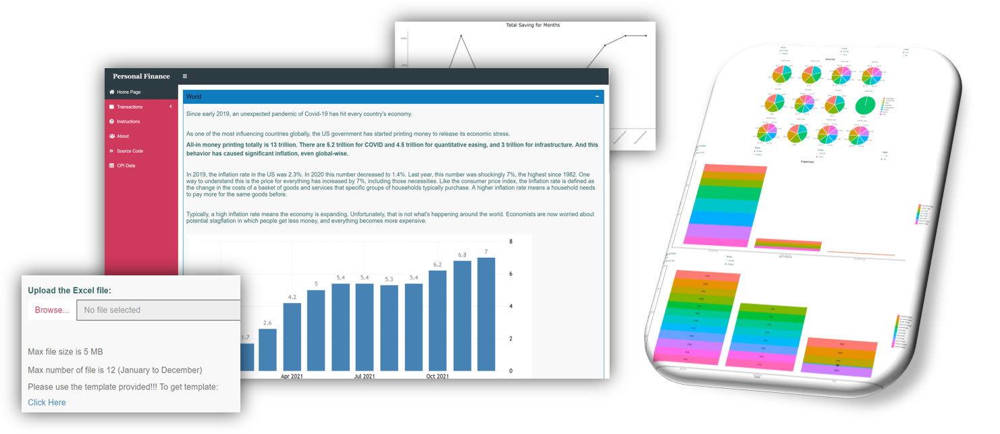

PERSONAL FINANCE DASHBOARD
========================================================
autosize: true
css: css-file.css
author: Group_O_Pocket

### LAI KE WEI (U2102777)  
### JianBang Dai()  
### Sishao Zou()  
### xxx()  

Why Personal Finance Dashboard?
========================================================
## Introduction
 
Nowadays, many people suffer in financial problem. The prices of the goods and services become higher and higher every year but the income is still the same as the amount in many years ago. Since we cannot change the social, political and economic environment, personal finance become very important now.  
 
## Stakeholders
 
Anyone who want to budget his expenses  
Anyone who like to know better about his economic status  
Anyone who feels headache analysing account by himself  
   
## Problem Statement
 
1. What are the biggest living expenses?  
2. What are the major income?  
3. Can people have savings after all expenses are paid?

Why Personal Finance Dashboard?
========================================================
Questions  
Solution  
Objective  
Summary Of Experience

Why Personal Finance Dashboard?
========================================================
## Data Set Used  
- Customer Price Index from: [https://data.worldbank.org/indicator/FP.CPI.TOTL](https://data.worldbank.org/indicator/FP.CPI.TOTL)

 Slide 5
========================================================
 
## Link to the App:
   
## Link to the Github:
 
 
 
 
 
 
## The End.  
## Thank You.
