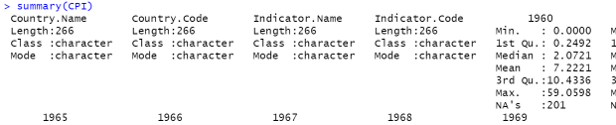

 
========================================================
css: css-file.css

### PERSONAL FINANCE DASHBOARD  
 
Lai Ke Wei (U2102777) 
Jianbang Dai (S2116427) 
Sizhao Zou (S2104420) 
Shizheng Zhang (S2023000)
-------[25 January 2022]  

========================================================
## Why Personal Finance Dashboard?
### Introduction

This is the presentation for the WIA1007 group project(create a beneficial Shiny App). Nowadays, many people suffer from financial problems because of the continuously increased prices of goods and services. Since we cannot change the social and economic environment, personal finance is becoming very important. Objective of this project is to provide a simple online tool to analyze their income and expenses and guideline to those who don't know where to start saving.
    

### Summary Of Experience

This Shiny App group project is very challenging for us since this is the first time to use R to build an app. In R, there are a lot of methods and functions we are not used to, and we need much time to think and find out the most suitable ways to perform analysis. However, it is still interesting to us. We basked in glory when we saw the app finished under schedule step by step.
  

========================================================

Stakeholders  

- Anyone who want to budget his expenses    
- Anyone who like to know better about his economic status    
- Anyone who feels headache analysing account by himself 
   

Problem Statement  

1. What is the reason of the continuously increased amount of people facing financial problems? 
2. What are the type of living expenses cost the most? 
3. What are the type of major income and minor income? 
4. Can people have savings after all expenses are paid? 

   

### Data Science Process
#### 1. Getting Data

@ Customer Price Index from: [https://data.worldbank.org/indicator/FP.CPI.TOTL](https://data.worldbank.org/indicator/FP.CPI.TOTL)  
@ Data Input from User, the .xlsx file
 

========================================================
#### 2. Data Cleaning & Analyzing  

  

We clean the data by remove incorrect, irrelevant and incomplete data so that they became organized and usable.

  

We use str() and summary() functions to know more details about our data.  
  

========================================================
#### 3. Data Visualisation

  

We use plot the data into different types of chart for easy understanding.
  
Link to the App: [https://wei3.shinyapps.io/Personal_Finance_Dashboard/](https://wei3.shinyapps.io/Personal_Finance_Dashboard/)    
Link to the Github Source Code:  [https://github.com/WEI-728/introdatascience/blob/main/dashboard/app.R](https://github.com/WEI-728/introdatascience/blob/main/dashboard/app.R)
 
 

## The End.  
## Thank You.
